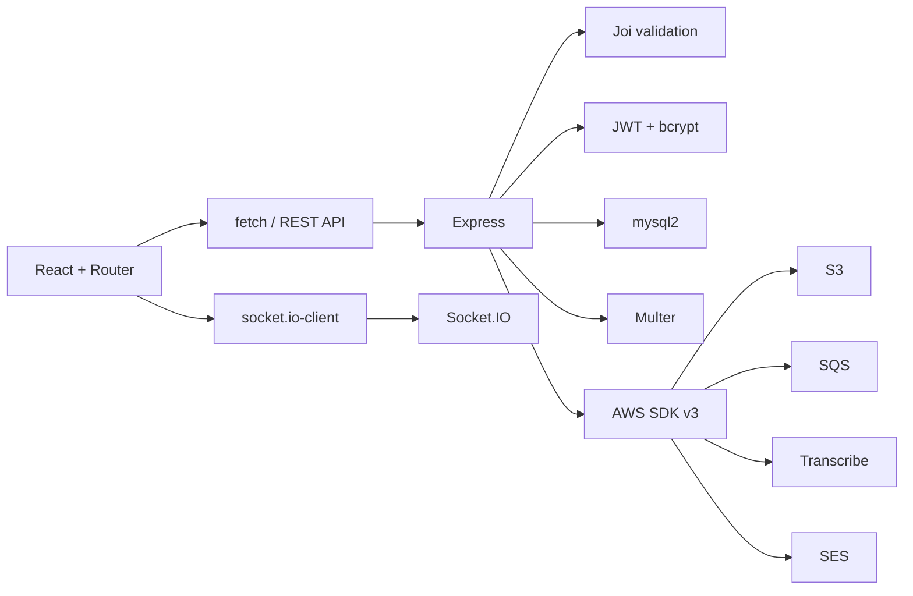

# Danh mục thư viện và công nghệ sử dụng trong VDCMS

Ngày kiểm kê: **02/07/2026**  
Nguồn phiên bản: `FE/package.json`, `BE/package.json` và hai file `package-lock.json`.

## 1. Quy ước

- Bảng dưới đây liệt kê **dependency trực tiếp** do project khai báo.
- Các package gián tiếp do npm tự cài được khóa phiên bản trong `package-lock.json`; không nên import trực tiếp nếu chưa thêm vào `package.json`.
- Ký hiệu `^` cho phép npm cập nhật bản minor/patch tương thích trong cùng major version.
- Frontend dùng JavaScript/JSX, chưa dùng TypeScript; `@types/*` hỗ trợ IDE và tooling.

## 2. Frontend — thư viện chạy trong trình duyệt

| Thư viện | Phiên bản khai báo | Vai trò trong project | Vị trí sử dụng tiêu biểu |
|---|---:|---|---|
| `react` | `^19.2.6` | Xây dựng giao diện theo component, state và hook | Toàn bộ `FE/src` |
| `react-dom` | `^19.2.6` | Gắn ứng dụng React vào DOM của trình duyệt | `FE/src/main.jsx` |
| `react-router-dom` | `^7.18.0` | Điều hướng SPA, route Guest/Admin/Manager/Engineer và trang 403 | `FE/src/routers/AppRouter.jsx`, `ProtectedRoute.jsx` |
| `socket.io-client` | `^4.8.3` | Kết nối realtime với backend cho chat và notification | `ChatWidget.jsx`, `NotificationBell.jsx` |
| `lucide-react` | `^1.22.0` | Bộ icon React nhất quán cho menu, nút, bảng và trạng thái | Layout, pages, common components |
| `clsx` | `^2.1.1` | Ghép class CSS có điều kiện | Các UI component cần thay class theo state |
| `class-variance-authority` | `^0.7.1` | Khai báo biến thể style cho component như button/card | `FE/src/components/ui` |
| `tailwind-merge` | `^3.6.0` | Gộp Tailwind class và loại class xung đột | Component UI dùng class động |

### Vì sao frontend không dùng Axios/Redux

- Project dùng `fetch` qua lớp `FE/src/services/apiClient.js`, nên không cần Axios.
- Auth, theme và language có phạm vi vừa phải, được quản lý bằng React Context; chưa cần Redux.
- Cách này giảm dependency và kích thước bundle, nhưng nếu state nghiệp vụ phức tạp hơn có thể cân nhắc TanStack Query/Zustand ở giai đoạn sau.

## 3. Frontend — thư viện phát triển và build

| Thư viện | Phiên bản khai báo | Vai trò |
|---|---:|---|
| `vite` | `^8.0.12` | Dev server, bundler và build production |
| `@vitejs/plugin-react` | `^6.0.1` | Tích hợp React/JSX và Fast Refresh với Vite |
| `tailwindcss` | `^4.3.1` | Utility CSS và nền tảng thiết kế responsive/theme |
| `@tailwindcss/vite` | `^4.3.1` | Tích hợp Tailwind trực tiếp vào pipeline Vite |
| `eslint` | `^10.3.0` | Kiểm tra lỗi và quy ước JavaScript/JSX |
| `@eslint/js` | `^10.0.1` | Bộ rule JavaScript chuẩn cho ESLint flat config |
| `eslint-plugin-react-hooks` | `^7.1.1` | Kiểm tra Rules of Hooks và dependency của hook |
| `eslint-plugin-react-refresh` | `^0.5.2` | Kiểm tra export phù hợp với React Fast Refresh |
| `globals` | `^17.6.0` | Khai báo global của browser/Node cho ESLint |
| `@types/react` | `^19.2.14` | Type metadata hỗ trợ IDE cho React |
| `@types/react-dom` | `^19.2.3` | Type metadata hỗ trợ IDE cho React DOM |

Các lệnh liên quan:

```powershell
cd FE
npm run dev
npm run lint
npm run build
npm run preview
```

## 4. Backend — web, database và bảo mật

| Thư viện | Phiên bản khai báo | Vai trò trong project | Ghi chú |
|---|---:|---|---|
| `express` | `^5.2.1` | HTTP API, router, middleware và error handler | Server chính tại `BE/server.js` |
| `mysql2` | `^3.22.5` | Connection pool và prepared query đến MySQL/RDS | Dùng API Promise; hỗ trợ TLS RDS |
| `socket.io` | `^4.8.3` | Realtime chat, notification và trạng thái khóa chat | Xác thực token khi handshake |
| `jsonwebtoken` | `^9.0.3` | Ký/xác minh JWT nội bộ và xác minh Cognito JWT RS256 | Backend luôn đọc role/status mới nhất từ DB |
| `bcryptjs` | `^3.0.3` | Hash và so khớp mật khẩu | Không lưu mật khẩu plaintext |
| `joi` | `^18.2.1` | Validation và làm sạch dữ liệu request | Auth, project, task, report, user, incident… |
| `multer` | `^2.2.0` | Nhận multipart upload vào vùng tạm | Có giới hạn dung lượng, MIME và kiểm tra chữ ký file |
| `cors` | `^2.8.6` | Chỉ cho phép các frontend origin được cấu hình | Danh sách từ `CORS_ORIGINS` |
| `helmet` | `^8.2.0` | Thêm security headers HTTP | Tắt lộ `X-Powered-By`, cấu hình resource policy |
| `express-rate-limit` | `^8.5.2` | Chống spam/brute-force cho API, auth, đăng ký, liên hệ và upload | Có limiter riêng theo loại thao tác |
| `dotenv` | `^17.4.2` | Đọc biến môi trường từ `.env` khi chạy local | Production lấy secret từ AWS rồi tạo EnvironmentFile |

## 5. Backend — AWS SDK

AWS SDK v3 được chia nhỏ theo dịch vụ để không cài cả SDK lớn.

| Thư viện | Phiên bản khai báo | Dịch vụ | Mục đích |
|---|---:|---|---|
| `@aws-sdk/client-s3` | `^3.1077.0` | Amazon S3 | Upload, download và xóa tài liệu/media/audio trong bucket private |
| `@aws-sdk/s3-request-presigner` | `^3.1077.0` | Amazon S3 | Tạo URL ký tạm thời cho ảnh, file và ghi âm chat |
| `@aws-sdk/client-sesv2` | `^3.1077.0` | Amazon SES | Gửi email xác minh và đặt lại mật khẩu |
| `@aws-sdk/client-sqs` | `^3.1077.0` | Amazon SQS | Gửi/nhận/xóa message cho Transcribe worker và đọc queue health |
| `@aws-sdk/client-transcribe` | `^3.1077.0` | Amazon Transcribe | Bắt đầu và theo dõi job chuyển audio thành text |

Thông tin xác thực AWS ưu tiên **IAM Role của EC2**. `AWS_ACCESS_KEY_ID`/`AWS_SECRET_ACCESS_KEY` chỉ là phương án cấu hình local; tuyệt đối không commit vào Git hoặc trả ra frontend.

## 6. Backend — module có sẵn của Node.js

Các module này không cần cài qua npm:

| Module | Công dụng trong project |
|---|---|
| `http` | Tạo HTTP server dùng chung cho Express và Socket.IO |
| `path` | Tạo đường dẫn file an toàn giữa Windows/Linux |
| `fs` | Đọc/xóa file upload tạm, đọc CA bundle RDS |
| `crypto` | UUID tên file, SHA/hash token, chuyển JWK Cognito thành public key |
| `node:test` | Chạy test backend bằng `npm test` |

Backend cũng dùng `fetch` tích hợp sẵn của Node.js để tải Cognito JWKS và kết quả transcript; không cần `node-fetch`.

## 7. Web API có sẵn của trình duyệt

Đây không phải npm package nhưng là phần quan trọng của chức năng:

| API | Công dụng |
|---|---|
| `fetch` | Gọi REST API qua `apiClient` |
| `localStorage` | Lưu token/user, theme, language, voice setting và bản nháp báo cáo |
| `MediaRecorder` + `getUserMedia` | Ghi âm chat và audio gửi Transcribe |
| `SpeechRecognition` / `webkitSpeechRecognition` | Chuyển giọng nói trực tiếp trong trình duyệt khi được hỗ trợ |
| `Geolocation` | Lấy tọa độ khi Engineer báo sự cố |
| `ServiceWorker` | Hỗ trợ PWA/offline shell cho bản build production |
| `FormData` | Gửi report, document, incident image, chat file và audio |

## 8. Công nghệ hạ tầng — không phải npm library

| Công nghệ/dịch vụ | Vai trò |
|---|---|
| AWS CloudFormation | Khai báo 61 tài nguyên hạ tầng bằng Infrastructure as Code |
| Amazon VPC | Tách public, private application và private database subnet |
| Amazon CloudFront | CDN/HTTPS cho frontend và reverse proxy cùng origin |
| Application Load Balancer | Health check và phân phối traffic đến EC2 |
| Amazon EC2 Auto Scaling | Chạy backend và Transcribe worker |
| Amazon RDS MySQL | Database production private, TLS và backup |
| Amazon Cognito | User Pool/MFA/JWT ở chế độ chuyển tiếp |
| AWS WAF | Managed Rules và rate limit trước ALB/Cognito |
| AWS IAM | Quyền truy cập AWS theo role, không hard-code access key |
| AWS Secrets Manager | Lưu RDS/JWT/bootstrap Admin secret |
| AWS Systems Manager | Quản trị EC2 không cần mở SSH |
| Amazon CloudWatch | Log, metric và cảnh báo khi vận hành thật |
| PowerShell | Script triển khai `infra/deploy-aws.ps1` |
| systemd | Chạy và tự khởi động lại API/worker trên EC2 |

## 9. Quan hệ giữa các nhóm thư viện



## 10. Quy trình cập nhật dependency an toàn

1. Tạo branch riêng.
2. Chạy trong từng thư mục:

   ```powershell
   npm outdated
   npm audit
   ```

3. Chỉ cập nhật một nhóm thư viện mỗi lần; đọc breaking changes khi tăng major version.
4. Không xóa `package-lock.json` để “chữa cháy”.
5. Sau cập nhật phải chạy:

   ```powershell
   cd BE
   npm test

   cd ..\FE
   npm run lint
   npm run build
   ```

6. Chạy lại các mục liên quan trong [`TEST-CHECKLIST.md`](./TEST-CHECKLIST.md).

## 11. File cấu hình liên quan

- Frontend dependency: [`FE/package.json`](../FE/package.json)
- Backend dependency: [`BE/package.json`](../BE/package.json)
- Frontend lockfile: [`FE/package-lock.json`](../FE/package-lock.json)
- Backend lockfile: [`BE/package-lock.json`](../BE/package-lock.json)
- Biến môi trường backend: [`BE/.env.example`](../BE/.env.example)
- Biến môi trường frontend: [`FE/.env.example`](../FE/.env.example)
