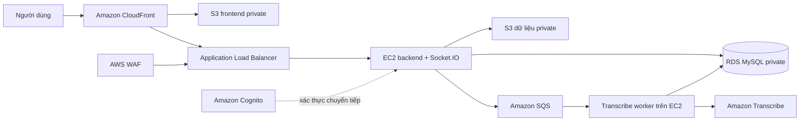

# Kiến trúc AWS của VDCMS

## Luồng production



CloudFront dùng Origin Access Control để đọc frontend từ bucket S3 không công khai. Các đường dẫn `/api/*`, `/socket.io/*` và `/uploads/*` được chuyển tiếp đến ALB, nên trình duyệt chỉ làm việc với một HTTPS origin. AWS khuyến nghị OAC và ký request bằng SigV4 cho S3 origin private.

## Mạng

- Hai public subnet chứa ALB và một NAT Gateway.
- Hai private application subnet chứa EC2 Auto Scaling Group.
- Hai private database subnet chứa RDS MySQL.
- RDS chỉ nhận cổng 3306 từ security group của backend.
- EC2 không mở SSH; quản trị qua AWS Systems Manager Session Manager.

## Dữ liệu và tác vụ giọng nói

- Tài liệu dự án, file/ghi âm chat và đầu vào Transcribe nằm trong bucket dữ liệu private, bật versioning và SSE-S3.
- File chat trong database chỉ lưu địa chỉ `s3://` nội bộ; API kiểm tra quyền rồi cấp URL ký tạm thời tối đa một giờ cho trình duyệt.
- API tạo bản ghi `transcription_jobs`, đưa message vào SQS và trả HTTP 202.
- Worker long-poll SQS, chạy Amazon Transcribe, lưu transcript vào RDS và xóa file tạm.
- Message lỗi ba lần được chuyển sang dead-letter queue.
- Nếu SQS chưa cấu hình, backend vẫn dùng chế độ Transcribe đồng bộ cũ; nếu Transcribe chưa cấu hình, frontend dùng Web Speech API.

## Xác thực Cognito

CloudFormation tạo User Pool, app client, MFA TOTP tùy chọn và ba group `admin`, `manager`, `engineer`. Backend chấp nhận cả JWT nội bộ hiện tại và Cognito ID/access token. Cognito token chỉ được ánh xạ đến tài khoản local có cùng email hoặc `cognito_sub`; vai trò và trạng thái trong RDS vẫn là nguồn phân quyền chính. Điều này cho phép chuyển đổi dần mà không làm hỏng tài khoản hiện có.

## Triển khai

Yêu cầu:

- AWS CLI đã đăng nhập vào đúng account.
- Repository Git mà EC2 có thể clone bằng HTTPS.
- Node.js/npm và PowerShell trên máy triển khai.
- Email SES đã xác thực nếu muốn gửi email thật.

Chạy từ thư mục gốc:

```powershell
.\infra\deploy-aws.ps1 `
  -RepositoryUrl https://github.com/your-account/your-repository.git `
  -BootstrapAdminEmail admin@example.com `
  -Region ap-southeast-1
```

Script triển khai CloudFormation, build frontend với API cùng origin, đồng bộ `FE/dist` lên S3 và xóa cache CloudFront. Không commit mật khẩu; RDS, JWT và Admin khởi tạo đều được sinh trong AWS Secrets Manager.

## Lưu ý chi phí và vận hành

- NAT Gateway, ALB, WAF và RDS là các tài nguyên tính phí ngay cả khi lưu lượng thấp.
- `DatabaseMultiAZ=false` phù hợp demo; production thật nên bật Multi-AZ.
- Auto Scaling đang giới hạn một backend vì Socket.IO chưa dùng Redis adapter chia sẻ. Chỉ tăng số EC2 sau khi bổ sung Amazon ElastiCache/Redis adapter.
- Ảnh sự cố và file báo cáo cũ vẫn còn cơ chế lưu local. Trước khi tăng số EC2 hoặc thay instance thường xuyên, cần chuyển nốt các nhóm file này sang S3 private.
- Không xóa stack production trước khi kiểm tra snapshot RDS và các bucket đang được giữ lại bằng `DeletionPolicy: Retain`.
