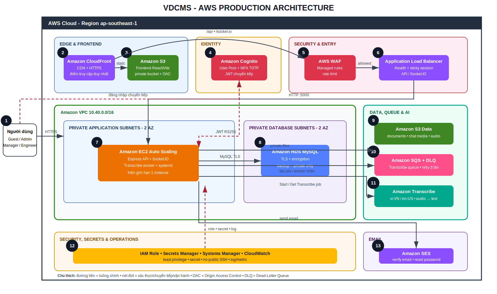

# Project Proposal

## Voice-Driven Construction Management System (VDCMS)

## 1. Thông tin đề tài

| Trường | Nội dung |
|---|---|
| Tên tiếng Việt | Hệ thống quản lý công trường điều khiển bằng giọng nói |
| Tên tiếng Anh | Voice-Driven Construction Management System |
| Tên viết tắt | VDCMS |
| Nhóm thực hiện | `[BỔ SUNG TÊN NHÓM/THÀNH VIÊN]` |
| Giảng viên hướng dẫn | `[BỔ SUNG]` |
| Nền tảng | Web application + AWS Cloud |
| Đối tượng sử dụng | Admin, Quản lý công trường, Kỹ sư hiện trường |

## 2. Bối cảnh và vấn đề cần giải quyết

Trong môi trường công trường, thông tin thường được trao đổi qua nhiều kênh rời rạc như giấy, bảng tính, điện thoại và ứng dụng nhắn tin. Cách làm này dẫn đến các vấn đề:

- Công việc giao cho kỹ sư khó theo dõi tập trung và dễ trễ hạn.
- Báo cáo hiện trường thiếu cấu trúc, khó tìm lại và khó kiểm tra người duyệt.
- Kỹ sư đang thao tác tại hiện trường không thuận tiện nhập văn bản dài.
- Tài liệu, hình ảnh và file âm thanh bị phân tán hoặc thất lạc.
- Sự cố an toàn, yêu cầu gia hạn và vướng mắc không có quy trình xử lý rõ ràng.
- Quyền Admin, Manager và Engineer dễ bị lẫn nếu chỉ kiểm soát ở giao diện.
- Khi nhân viên nghỉ việc, việc xóa hẳn tài khoản có thể làm mất dấu lịch sử dự án.
- Hệ thống chạy trên một máy local thiếu khả năng truy cập công khai, sao lưu, bảo mật và mở rộng.

## 3. Đề xuất giải pháp

VDCMS là hệ thống web tập trung toàn bộ vòng đời vận hành công trường:

1. Admin quản trị người dùng, dự án, giao việc cấp Manager, báo cáo, audit log và cấu hình AWS.
2. Manager quản lý dự án thuộc phạm vi, giao việc cho Engineer, duyệt báo cáo/yêu cầu và xử lý sự cố.
3. Engineer nhận việc, cập nhật checklist/timeline, gửi báo cáo, ghi âm chuyển thành văn bản và báo sự cố tại hiện trường.
4. Chat realtime cho phép trao đổi text, voice, hình ảnh và tài liệu; Admin có thể giám sát và khóa cuộc trò chuyện khi cần.
5. Tài khoản bị xóa theo cơ chế soft delete để bảo toàn lịch sử; yêu cầu xóa của Manager cần lý do và Admin phê duyệt.
6. Hạ tầng AWS cung cấp frontend CDN, backend compute, database private, object storage, xác thực, queue, speech-to-text và lớp bảo vệ web.

## 4. Mục tiêu

### 4.1 Mục tiêu tổng quát

Xây dựng và triển khai một hệ thống quản lý công trường trên AWS giúp số hóa giao việc, theo dõi tiến độ, báo cáo hiện trường và phối hợp giữa các vai trò theo thời gian thực.

### 4.2 Mục tiêu cụ thể

- Quản lý tập trung dự án, công việc, báo cáo, tài liệu và sự cố.
- Phân quyền nhất quán ở cả frontend, API và Socket.IO.
- Hỗ trợ nhập báo cáo bằng tiếng Việt/Anh qua giọng nói.
- Cho phép theo dõi tiến độ bằng dashboard, KPI, checklist, timeline và lịch deadline.
- Duy trì lịch sử nhân sự bằng soft delete và audit log.
- Lưu file quan trọng trong S3 private thay vì phụ thuộc ổ đĩa một máy chủ.
- Tách Transcribe khỏi request chính bằng SQS để xử lý bất đồng bộ và retry.
- Triển khai hạ tầng bằng CloudFormation để có thể tái tạo và kiểm tra.
- Thiết kế bảo mật theo private subnet, WAF, IAM Role, Secrets Manager và TLS.

## 5. Người dùng và giá trị mang lại

| Vai trò | Nhu cầu | Giá trị nhận được |
|---|---|---|
| Admin | Quản trị toàn hệ thống và giám sát | Một màn hình tổng quan; quản lý role/status/soft delete; audit và AWS health |
| Manager | Điều hành dự án và đội kỹ sư | Giao việc, lịch hạn, KPI, duyệt báo cáo/yêu cầu, quản lý sự cố/tài liệu |
| Engineer | Thực hiện và báo cáo tại hiện trường | Task cá nhân, checklist, báo cáo có bản nháp, voice-to-text, sự cố có vị trí/ảnh |
| Doanh nghiệp | Lưu lịch sử và giảm rủi ro vận hành | Dữ liệu tập trung, phân quyền, backup, khả năng truy vết và giảm phụ thuộc trao đổi thủ công |

## 6. Chức năng chính

### 6.1 Guest và xác thực

- Trang giới thiệu sản phẩm, điều khoản, bảo mật và form liên hệ.
- Đăng ký Engineer, xác minh email, đăng nhập, quên/đặt lại mật khẩu.
- Dark/light mode và song ngữ Việt/Anh.

### 6.2 Admin

- Dashboard tổng quan vận hành.
- CRUD dự án; giao việc cho Engineer; giao nhiệm vụ cấp Manager.
- Duyệt báo cáo, task request và xử lý sự cố.
- Quản lý user, hồ sơ công ty, trạng thái và nâng/hạ quyền Engineer/Manager.
- Xóa mềm trực tiếp; duyệt yêu cầu xóa của Manager; khôi phục user.
- Xem contact request, activity log, chat monitor và trạng thái dịch vụ AWS.

### 6.3 Manager

- Dashboard/KPI theo phạm vi dự án.
- Project workspace gồm task, engineer, report, incident và document.
- Giao/sửa task có lý do và timeline thay đổi.
- Lịch deadline, analytics, xuất CSV và in/lưu PDF.
- Duyệt report/request; quản lý sự cố; upload tài liệu theo phiên bản.
- Cập nhật assignment Admin giao và gửi yêu cầu xóa Engineer có lý do.

### 6.4 Engineer

- Dashboard và lịch công việc cá nhân.
- Chi tiết task, checklist và cập nhật hiện trường.
- Báo cáo tiến độ manual/voice/mixed có bản nháp local.
- Yêu cầu gia hạn, báo blocker và theo dõi quyết định.
- Báo sự cố an toàn kèm severity, ảnh, địa điểm và tọa độ.
- Xem/tải tài liệu dự án được phân công.

### 6.5 Realtime và notification

- Chat text, voice, image và document bằng Socket.IO.
- Tin nhắn căn trái/phải theo người gửi.
- Notification realtime và đánh dấu đã đọc.
- Admin monitor và khóa/mở khóa conversation.

## 7. Giải pháp kỹ thuật

| Lớp | Công nghệ |
|---|---|
| Frontend | React 19, Vite 8, React Router, Tailwind CSS, Socket.IO Client |
| Backend | Node.js, Express 5, Socket.IO, Joi, Multer, JWT, bcrypt |
| Database | MySQL local / Amazon RDS for MySQL production |
| Storage | Local fallback / Amazon S3 private production |
| Voice AI | Web Speech API fallback / Amazon Transcribe production |
| Queue | Amazon SQS + Dead-Letter Queue |
| Identity | JWT hiện tại + Amazon Cognito dual-auth/chuyển tiếp |
| Compute/Network | EC2 Auto Scaling, ALB, VPC, public/private subnet, NAT/IGW |
| Delivery | S3 Frontend + Amazon CloudFront OAC |
| Security/Operations | AWS WAF, IAM, Secrets Manager, Systems Manager, CloudWatch |
| Email | Amazon SES, Resend/outbox fallback |
| Infrastructure as Code | AWS CloudFormation + PowerShell deploy script |

## 8. Lợi ích dự kiến

### 8.1 Lợi ích nghiệp vụ

- Giảm nhập liệu lặp lại và giảm thời gian lập báo cáo hiện trường.
- Tăng tính minh bạch về người giao, người nhận, tiến độ và người duyệt.
- Phát hiện việc quá hạn, báo cáo chờ duyệt và sự cố ưu tiên sớm hơn.
- Lưu tài liệu và lịch sử nhân sự tập trung để dễ kiểm tra.

### 8.2 Lợi ích kỹ thuật

- Frontend phân phối nhanh qua CloudFront và S3 private.
- Backend/database nằm trong mạng được phân lớp rõ ràng.
- File không phụ thuộc vòng đời của EC2.
- Transcribe bất đồng bộ nên request không phải chờ AI xử lý lâu.
- Hạ tầng có thể tạo lại từ CloudFormation thay vì thao tác tay không kiểm soát.

### 8.3 Lợi ích học thuật

- Kết hợp web full-stack, realtime, bảo mật, AI speech-to-text và cloud architecture.
- Có sản phẩm, mã nguồn, sơ đồ, test checklist và workshop triển khai để đánh giá toàn diện.

## 9. Phạm vi

### Trong phạm vi

- Web responsive cho ba vai trò và Guest.
- Quản lý dự án/công việc/báo cáo/tài liệu/sự cố.
- Realtime chat/notification.
- Voice-to-text và tích hợp AWS nêu trên.
- IaC, tài liệu triển khai và kiểm thử.

### Ngoài phạm vi phiên bản hiện tại

- Ứng dụng mobile native.
- BIM/3D model và tích hợp thiết bị IoT công trường.
- Tính lương, kế toán, mua sắm vật tư và ERP đầy đủ.
- Nhiều EC2 Socket.IO đồng thời trước khi bổ sung Redis adapter.
- Di chuyển hoàn toàn user hiện hữu sang Cognito Hosted UI.

## 10. Chỉ số thành công

| Chỉ số | Mục tiêu nghiệm thu |
|---|---|
| Phân quyền | Role sai không truy cập được trang/API; có trang 403 |
| Luồng nghiệp vụ | Tạo project → giao task → Engineer report → Manager/Admin review chạy hoàn chỉnh |
| Voice | Audio hợp lệ tạo transcript hoặc fallback rõ ràng |
| Realtime | Tin nhắn/notification đến mà không cần refresh |
| File | File hợp lệ tải được; file giả/sai quyền bị chặn |
| AWS | CloudFormation hoàn tất; CloudFront URL truy cập được; ALB target healthy |
| Kiểm thử | Toàn bộ test Critical/High trong checklist đạt |
| Bảo mật | Không lộ secret; RDS/S3 private; password được hash |

## 11. Rủi ro và phương án xử lý

| Rủi ro | Ảnh hưởng | Phương án |
|---|---|---|
| AWS phát sinh chi phí | Vượt ngân sách nhóm | Tạo Budget/alert; dùng cấu hình demo; xóa tài nguyên sau nghiệm thu |
| SES còn sandbox | Email không gửi đến địa chỉ bất kỳ | Verify sender/receiver hoặc xin production access; giữ outbox fallback |
| Cognito migration phức tạp | Tài khoản cũ đăng nhập không đồng nhất | Dual-auth; map bằng email/cognito_sub; chuyển đổi theo giai đoạn |
| Socket.IO nhiều EC2 | Mất sự kiện giữa instance | Giữ một EC2 cho demo; bổ sung Redis adapter trước khi scale-out |
| Audio nhiễu/không hỗ trợ | Transcript kém | Cho sửa transcript, hỗ trợ vi-VN/en-US và Web Speech fallback |
| Mất dữ liệu/file | Ảnh hưởng lịch sử | S3 versioning, RDS backup/snapshot, soft delete user |
| Thiếu ảnh Workshop | Không chứng minh được deploy | Chụp theo danh sách bắt buộc ngay trong từng bước triển khai |

## 12. Sản phẩm bàn giao

- Source code FE/BE.
- Website production chạy trên AWS và URL truy cập.
- CloudFormation + deploy script.
- Sơ đồ kiến trúc `.drawio` và `.svg`.
- Proposal, Worklog, Project và Workshop.
- Checklist 224 test case và tài liệu thư viện.
- Ảnh triển khai và kết quả kiểm thử.

## 13. Trạng thái

Mã nguồn, IaC và tài liệu đã sẵn sàng. Website AWS thật **chưa được provision trong tài liệu này**; cần cập nhật URL, ảnh và kết quả test sau khi nhóm triển khai bằng tài khoản AWS của mình.

